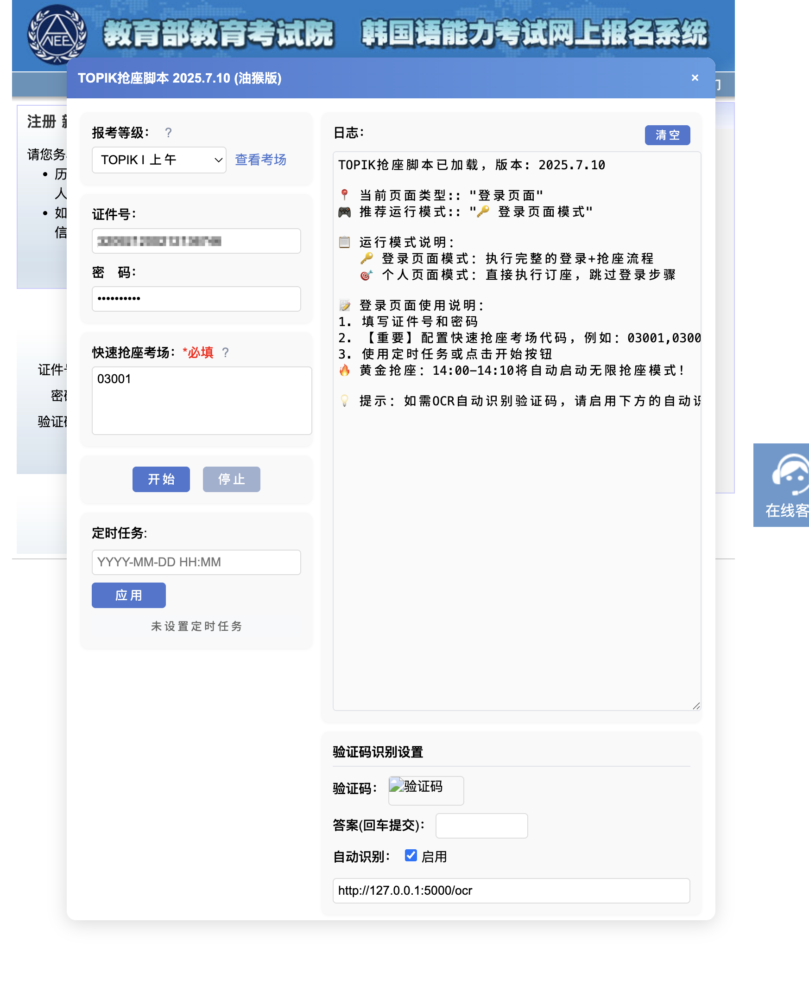
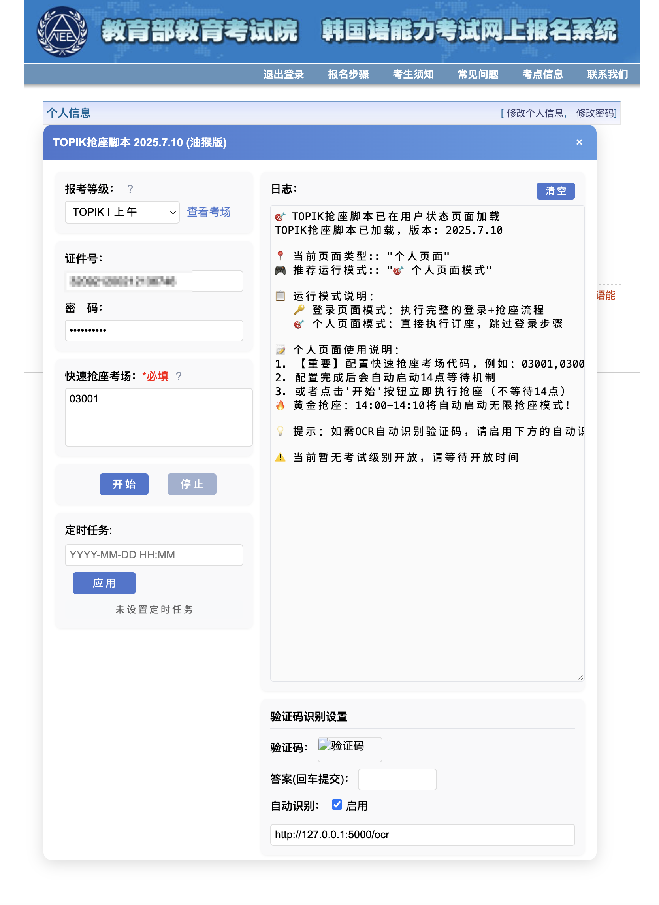

# topik-auto-booking
适用于韩国语能力考试（TOPIK）报名网站的自动化油猴（Tampermonkey）脚本，支持自动登录、抢座、验证码OCR自动识别和错误自动重试功能。

## 程序界面
<!-- 默认载入界面示例 -->

<!-- 程序运行示例 -->

## 功能概述

### 自动登录
- 自动保存并填充登录信息（账号密码本地加密存储）
- 密码SHA-256哈希加密，安全可靠

### 智能抢座
- 支持设定特定的抢座启动时间（默认下午2点开抢）
- 可同时配置多个目标考点，并设置优先级
- 支持快速抢座功能，跳过考点查询直接抢座

### OCR验证码识别
- 支持调用自定义OCR服务自动识别验证码
- 验证码识别失败时自动重试或手动输入备用

### 错误处理与自动重试
- 请求超时、网络异常时自动重试
- 自适应调整超时时间，提升成功率

### 参数灵活配置
- 抢座间隔、超时重试时间、自动启动时间均可自由配置
- 自定义OCR服务地址与开关功能

### 用户友好界面
- 页面内置控制面板，配置参数更直观方便
- 实时日志展示抢座状态与错误信息，便于排错

### 通知功能
- 支持配置手机号，抢座成功时自动发送短信通知（需自备短信服务接口）

## 安装方法

1. 安装油猴扩展：[Tampermonkey官网](https://www.tampermonkey.net/)
2. 新建脚本并复制`topik.js`文件的代码，保存并启用
3. 打开[TOPIK报名网站](https://topik.neea.cn) 自动加载脚本界面

## 使用说明

1. 配置账号密码、考试级别、目标考场
2. 如需自动抢座，设置具体自动启动时间（建议提前几分钟）
3. 开启或关闭OCR识别功能，配置OCR服务地址
4. 可选开启短信通知功能（需自备短信推送接口）

## 注意事项

- 本脚本仅作学习交流使用，请勿用于非法用途。
- 抢座成功受官网服务器状况、网络环境等多种因素影响。
- 使用前请先进行测试，确保配置正确。

## 开源许可

MIT License

